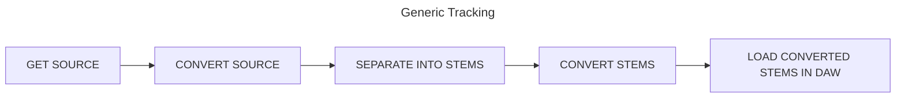
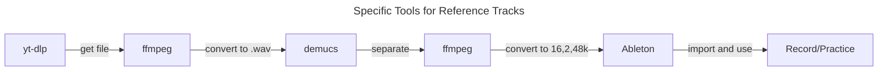

# Workflow for Audio Tracks...

**TODO:** 
- [ ] There was mention somewhere in demucs docs about guitar and piano separation, find out where and modify to suit
- [ ] Look into filename renaming with yt-dlp switch --restrict-filenames
  * Of course, you could also do this within the python script that automates all this.
- [ ] Script all this nonsense with python or similar

<details>
<summary>Tool docs</summary>

[Mermaid Docs for flowchart](https://mermaid.js.org/syntax/flowchart.html)  
[Emoji listing for icons in this doc](https://gist.github.com/rxaviers/7360908)  
[yt-dlp docs](https://github.com/yt-dlp/yt-dlp)  
[ffmpeg docs](https://ffmpeg.org/ffmpeg.html)  
[Demucs Docs](https://github.com/adefossez/demucs)  
[Demucs GUI Docs](https://github.com/CarlGao4/Demucs-Gui)  USE THIS!  
[Ableton Live Docs](https://cdn-resources.ableton.com/resources/manual/2023-03-30/l11manual_en.pdf)  
[Focusrite Control Docs](https://fael-downloads-prod.focusrite.com/customer/prod/s3fs-public/downloads/Focusrite%20Control%20Scarlett%203rd%20Gen%20User%20Guide%20v2.pdf)  
[Focusrite Scarlett Docs](https://fael-downloads-prod.focusrite.com/customer/prod/downloads/Scarlett%2018i20%203rd%20Gen%20User%20Guide%20V2.pdf)  
[GeForce 3050RTX Ti Compute Capability](https://developer.nvidia.com/cuda-gpus)  apprently my GPU has an 8.6  
</details>

## Flows 







## Specifics

~~### Open anaconda prompt~~ 
~~Anaconda is simplest way on windows to use demucs~~
~~* Do everything that follows from within the anaconda prompt venv~~


### Use the Demucs GUI instead of anaconda prompt
GUI is by far the simplest way to do things

### CD into root storage folder
Wherever you keep it (e.g. "D:\music")
* if you don't have "base folders", make some, e.g.:
  * "D:\music\ripped_tracks"
  * "D:\music\wav_tracks"
  * "D:\music\ogg_tracks"
  * "D:\music\flac_tracks"
* demucs will make it's own folder structure e.g. "D:\music\separated\somefilename"

### Get a reference track

Grab best-quality, audio only (-f "ba") from youtube and store the .webm in "ripped_tracks".  See the [yt-dlp docs](https://github.com/yt-dlp/yt-dlp) for info.

```cmd 
yt-dlp -f "ba" -o "ripped_tracks\%(title)s.f%(format_id)s.%(ext)s" "https://www.youtube.com/watch?v=fGavl_m41LE&pp=ygUSYXJldGhhIHJvY2sgc3"
```

> :memo:
> The above spits out:  
> "Title1 Title2 - Title3 Title4 (Other Title Stuff).formatID.extension"  
> as track name in "ripped_tracks" folder

> [!NOTE]
> You could also record the base track directly from audio interface loopback (physical or logical), export it from DAW, and then separate.  Or, you could rip track from CD, and then use ripped .wav as source.  There are multiple ways to get a track

### Use ffmpeg to convert ripped track to .wav 
Demucs only uses .wav files (as far as I can tell), so you need this format

>```cmd
>ffmpeg -i "Aretha Franklin - Rock Steady (Official Lyric Video).f251.webm" -vn "Aretha_Franklin-Rock_Steady.wav"
>```
> The above command produces same output as using (-c:a pcms16le).  **Ableton** only supports .wav and .aiff without any input conversion.  So the others seem academic (16bit PCM LE encoding seems to be fine for what we're doing)

<details>
<summary>Alternative Commands for different output bit-depth</summary>

> **16 bit**
>```cmd
>ffmpeg -i "Aretha Franklin - Rock Steady (Official Lyric Video).f251.webm" -vn -c:a pcm_s16le "wav_tracks\Aretha_Franklin-Rock_Steady16.wav"
>```

> **24 bit**
> ```cmd
>ffmpeg -i "Aretha Franklin - Rock Steady (Official Lyric Video).f251.webm" -vn -c:a pcm_s24le "wav_tracks\Aretha_Franklin-Rock_Steady24.wav"
>```

> **32 bit**
>```cmd
>ffmpeg -i "Aretha Franklin - Rock Steady (Official Lyric Video).f251.webm" -vn -c:a pcm_s32le "wav_tracks\Aretha_Franklin-Rock_Steady32.wav"
>```

</details>

<details>
<summary>Conversion to other formats besides WAV</summary>

> [!NOTE] 
> These commands convert the track to .ogg or .flac.  
> FLAC is huge from a filesize perspective, but there's no loss.  Ogg is much much smaller (but is lossy).

Convert to "flac" and store in flac_tracks 
```cmd
ffmpeg -i "Aretha Franklin - Rock Steady (Official Lyric Video).f251.webm" -vn "flac_tracks\Aretha_Franklin-Rock_Steady.flac"
```

Convert to "ogg" and store in ogg_tracks
```cmd
ffmpeg -i "Aretha Franklin - Rock Steady (Official Lyric Video).f251.webm" -vn "ogg_tracks\Aretha_Franklin-Rock_Steady.ogg"
```

</details>

> [!NOTE]
> See [ffmpeg docs](https://ffmpeg.org/ffmpeg.html) for details on above sections


### Demucs / separate the .wav file into stems
```cmd
demucs "wav_tracks\<whatever_the_file_name_is>.wav"
```

This will spit out the separations in the "separated\htdemucs\file_name\" folder. 

> [!NOTE]
> Per [Demucs Docs](https://github.com/adefossez/demucs) the output files from demucs are all 16bit pcm, 2ch at 44.1khz

The above is valid for command line usage of demucs on your PC.  However!  Use the demucs GUI instead (And use the CUDA version, since the GeForce RTX 3050Ti has the proper compute capability of 8.6).  CUDA version is a hell of a lot faster than CPU version.
* Use this absolute path for it: 
  * "D:/__music/separated/{model}/{track}/{stem}.{ext}"
  * It will put things into the correct folder 
    * htdemucs_6s for 6 stem
      * Bass, drums, guitar, other, vocal, piano
    * htdemucs for normal 4 stem separation
      * Bass, drums, other, vocal

### Convert the demucs output files to 16bit, 2ch, 48kHz

> :memo: 
> 48khz, 2 Channel, 16bit LE PCM wav files.
 
```cmd
ffmpeg -i drums.wav -af "aformat=sample_fmts=s16:sample_rates=48000" drums48.wav
ffmpeg -i bass.wav -af "aformat=sample_fmts=s16:sample_rates=48000" bass48.wav
ffmpeg -i vocals.wav -af "aformat=sample_fmts=s16:sample_rates=48000" vocals48.wav
ffmpeg -i other.wav -af "aformat=sample_fmts=s16:sample_rates=48000" other48.wav
```

### Use Stems in Ableton
Create an appropriate live set with:
* Group of tracks (e.g. "Demucs")
  * Track for Bass stem
  * Track for Drums stem
  * Track for Others stem
  * Track for Vocal stem
  
> :memo: 
> The separated tracks are listed in the Ableton directory in file manager


### 8. Use the reference as click or reference for recording or practice

Add in the tracks to the appropriate slots within the "demucs" track group

Now you can mute e.g. the drums to have a drumless track to practice with, etc.

### 9. Automation

